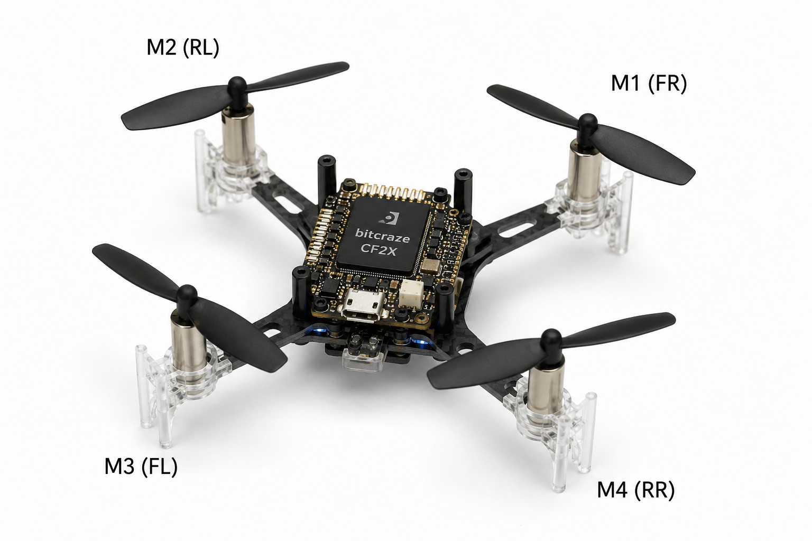

<div align="center">
  <h1> Crazyflie V2.1 Fault-Tolerant Hover Benchmark</h1>
  <h3>Benchmarking PID vs. Zero-Shot SAC vs. Domain Randomization</h3>

  <p><i>A reinforcement learning pipeline for training and evaluating a Crazyflie V2.1 nano-quadrotor's ability to hover under motor failure conditions in PyBullet.</i></p>

  <br/>
  
  <p>
    
    
    
  </p>
</div>

---

##  Benchmarking Overview

This repository benchmarks three distinct control approaches against progressive motor degradation (fault injection). The goal is to evaluate robustness and steady-state hover accuracy when motors lose efficiency.

1. **PID (Baseline)**: A standard cascaded PID controller, tuned for nominal flight.
2. **Zero-Shot SAC (Nominal)**: A Soft Actor-Critic agent trained *only* in nominal, fault-free conditions, tested "zero-shot" under unforeseen faults.
3. **Domain Randomization SAC (DR)**: A SAC agent trained with domain randomization (motor efficiencies uniformly sampled between 60% and 100% per episode), forcing it to implicitly learn redundant, fault-tolerant control allocation.

---

##  Benchmark Results

We evaluated the controllers against four test cases (TC), increasing in severity. Faults are represented by an efficiency vector `α = [m0, m1, m2, m3]`. Each result is **averaged over 5 independent episodes** (5 × 1000 steps @ 48 Hz).

### Summary Table

| Test Case | Fault Vector `α` | PID Mean Error | Nominal SAC Mean Error | DR SAC Mean Error |
| :--- | :---: | :---: | :---: | :---: |
| **TC-1: Nominal** | `[1.000, 1.000, 1.000, 1.000]` | 0.0220 m | 0.0277 m | **0.0195 m** |
| **TC-2: Alt-motor 15% fault** | `[0.850, 1.000, 0.850, 1.000]` | 0.0497 m | 0.0353 m | **0.0350 m** |
| **TC-3: Adj-motor 15% fault** | `[0.850, 0.850, 1.000, 1.000]` | CRASH (step ~6) | 0.0506 m | **0.0413 m** |
| **TC-4: Adj-motor 26% fault** | `[0.745, 0.745, 1.000, 1.000]` | CRASH (step ~5)| CRASH (step ~678)| **0.0598 m**|

> **Key Takeaway**: DR SAC is the only controller to complete all 5 episodes in every test case. PID fails immediately under adjacent-motor faults; Nominal SAC eventually crashes under severe asymmetric degradation.

### Statistical Detail (from `software_experiments/experiment_results.csv`)

| TC | Controller | Mean Error (m) | Std Dev (m) | Episodes Completed | Avg Crash Step |
| :--- | :--- | :---: | :---: | :---: | :---: |
| TC-1 | DR SAC | 0.019539 | 0.000276 | 5/5 | — |
| TC-1 | Nominal SAC | 0.027698 | 0.000263 | 5/5 | — |
| TC-1 | PID | 0.021965 | 0.000000 | 5/5 | — |
| TC-2 | DR SAC | 0.035042 | 0.000542 | 5/5 | — |
| TC-2 | Nominal SAC | 0.035332 | 0.000426 | 5/5 | — |
| TC-2 | PID | 0.049709 | 0.000000 | 5/5 |Yaw drift |
| TC-3 | DR SAC | 0.041329 | 0.000006 | 5/5 | — |
| TC-3 | Nominal SAC | 0.050554 | 0.000097 | 5/5 | — |
| TC-3 | PID | — | — | 0/5 | Step 6 |
| TC-4 | DR SAC | 0.059760 | 0.000293 | 5/5 | — |
| TC-4 | Nominal SAC | — | — | 0/5 | Step 678 |
| TC-4 | PID | — | — | 0/5 | Step 5 |

---

##  How it Works

**State Space (16-dim):**
Position (x, y, z), linear velocity, Euler angles, angular rates, goal altitude (`z_target`), integral error accumulators (`Ix, Iy, Iz`).

**Action Space (4-dim):**
Normalized per-motor RPM commands ∈ `[0, 1]`, scaled to `MAX_RPM`. Direct per-motor control enables fault injection by multiplying outputs by an efficiency vector `α`.

**Training Approaches:**
- **Zero-Shot SAC**: Fixed `α = [1, 1, 1, 1]`, trained for 1.5M timesteps.
- **DR SAC**: Motor efficiency randomized `f_ep ~ U[0.60, 1.00]` each episode, trained for 2M timesteps. The agent learns fault-robust motor redistribution implicitly to avoid crashing during low-efficiency episodes.

**Fault-Tolerance Mechanism:**
PID fails under adjacent-motor faults because its rigid cascade structure applies full corrective torque instantly, driving the drone into the ground. Zero-Shot SAC learns a somewhat smooth, robust action distribution just through exploration, but struggles with severe faults. DR SAC explicitly learns to map severe asymmetric state errors into redistributed thrust commands, surviving 26% degradation completely unseen during its `[0.60, 1.00]` randomized training.

**Fault Injection via Monkeypatching:**
`software_experiments/run_experiment.py` dynamically overrides `env._preprocessAction` with `types.MethodType` at runtime, injecting the TC-specific fault vector without modifying any source files. This ensures reproducible and isolated fault conditions for each controller.

---

##  Project Structure

```text
Fault_Tolerant/
├── custom_hover_env.py        # Nominal Gymnasium env & reward function
├── custom_hover_env_dr.py     # Environment with Domain Randomization logic
├── train_nominal.py           # SAC training script for Zero-Shot agent
├── train_dr.py                # SAC training script for DR agent
├── inference.py               # Single-run evaluation for Zero-Shot SAC
├── inference_dr.py            # Single-run evaluation for DR SAC
├── inference_pid.py           # Single-run evaluation for PID baseline
├── launch_pid.py              # Launch file for real-world PID deployment
├── launch_policy.py           # Launch file for real-world SAC deployment
├── pid_node.py                # ROS 2 node running PID controller
├── policy_node.py             # ROS 2 node running trained SAC models
├── z_target_publisher.py      # Publishes z_target via ROS 2
├── software_experiments/      # Automated benchmark scripts & plotting
│   ├── run_experiment.py      # Automated multi-agent benchmark
│   ├── plot_ieee.py           # IEEE-compliant plotter
│   └── experiment_results.csv # Aggregated statistical results
├── hardware_experiments/      # Hardware telemetry logging and plotting
│   ├── hw_logger.py           # Logs telemetry to CSV during flight
│   └── plot_hw_ieee.py        # Generates plots from hardware logs
├── Plots/                     # IEEE-compliant PNG plots, one per TC scenario
├── logs_hover_sac/            # Saved models for Zero-Shot SAC
└── logs_hover_sac_dr/         # Saved models for DR SAC
```

---

##  Setup & Usage

### Prerequisites
Requires Python 3.8+.
```bash
pip install stable-baselines3 pybullet gymnasium torch numpy matplotlib gym-pybullet-drones pandas
```

### Running the Full Automated Benchmark

`software_experiments/run_experiment.py` is fully automated — no arguments required. It runs all 4 test cases × 3 controllers × 5 episodes headlessly and saves results to `software_experiments/experiment_results.csv`.

```bash
# Run the full benchmark (headless, no GUI)
cd software_experiments
python3 run_experiment.py
cd ..
```

**What it does:**
- Loads Nominal SAC and DR SAC models once.
- Iterates over TC-1 → TC-4, monkeypatching the fault vector per TC.
- Runs 5 episodes per controller per TC (1000 steps/ep at 48 Hz).
- Prints a formatted summary table to the console.
- Saves aggregated statistics (mean, std dev, crash info) to `experiment_results.csv`.

### Generating IEEE-Compliant Plots

`software_experiments/plot_ieee.py` takes a **telemetry CSV** (time-series z-error and x/y position, logged per-step by the individual inference scripts) and produces a dual-panel IEEE-formatted plot.

```bash
# Generate a dual-panel IEEE plot from a per-step telemetry CSV
python3 software_experiments/plot_ieee.py --csv "(0.741,0.741,1,1).csv"

# Other TC plots
python3 software_experiments/plot_ieee.py --csv "(1,1,1,1).csv"
python3 software_experiments/plot_ieee.py --csv "(0.85,1,0.85,1).csv"
python3 software_experiments/plot_ieee.py --csv "(0.85,0.85,1,1).csv"
```

Pre-generated plots are stored in the `Plots/` directory.

### Evaluating Individual Controllers (Single Run)

```bash
python inference.py      # Zero-Shot SAC (single episode, optional GUI)
python inference_dr.py   # DR SAC (single episode, optional GUI)
python inference_pid.py  # PID baseline (single episode, optional GUI)
```

### Hardware Deployment & Experiments

We deploy our controllers on real Crazyflie v2.1 hardware using ROS 2 to validate sim-to-real performance.

**1. Launching the Controller:**
First, start the Crazyflie ROS 2 driver and then launch the desired controller:
```bash
# Terminal 1: Core Driver
source ~/crazyflie_ws/install/setup.bash
ros2 launch crazyflie launch.py mocap:=False gui:=False

# Terminal 2: Choose your controller
ros2 launch launch_policy.py       # DR-SAC
# OR
ros2 launch launch_pid.py          # PID

# Terminal 3: Publish Target Height
python3 z_target_publisher.py
```

**2. Logging & Plotting Telemetry:**
Record real flight data and generate IEEE-compliant plots:
```bash
# Terminal 4: Log telemetry for a 30% thrust loss on motor 2 with PID
python3 hardware_experiments/hw_logger.py --controller pid --fault 1.0_1.0_0.7_1.0

# Generate hardware plots (PNG/PDF):
python3 hardware_experiments/plot_hw_ieee.py --save
```

### Training the Models

```bash
# 1. Train Zero-Shot (Nominal) Agent (~1.5M timesteps)
python train_nominal.py

# 2. Train Domain Randomization Agent (~2M timesteps)
python train_dr.py
```

---

##  Key Design Decisions

- **Goal-Conditioned Architecture**: A dynamic `z_target ∈ [0.2, 2.5] m` randomized each episode ensures the policy generalizes across altitudes rather than memorizing one fixed point.
- **Integral Error Augmentation**: Passing `(Ix, Iy, Iz)` to the SAC observation vector gives the agent learnable I-term memory, mimicking a PID controller to drastically reduce steady-state altitude error.
- **Smoothness Penalty**: Penalizing large delta actions (`|a_t − a_{t−1}|`) is critical. Unpenalized SAC outputs jittery RPM commands that would destroy physical motors.
- **Monkeypatch Fault Injection**: Overriding `_preprocessAction` via `types.MethodType` at the instance level (not the class level) keeps environment source files unmodified and makes each TC's fault vector fully reproducible and isolated.
- **Statistical Rigor**: Benchmarks are averaged over 5 independent episodes per controller per TC, with standard deviation reported, to account for stochastic resets in the environment.

---
